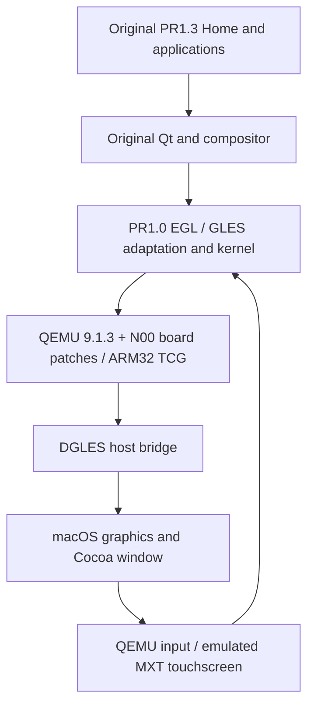

# Harmattan QEMU

[简体中文](README.zh-CN.md) · [Build](docs/building.md) · [Status](docs/status.md) · [Contribute](CONTRIBUTING.md)

**Run, study, and preserve the Nokia N9's original Harmattan experience on Apple Silicon.**

Harmattan QEMU brings Nokia's experimental N00 board support forward to QEMU 9.1.3 and connects its legacy graphics protocol to a native macOS backend. It runs original Harmattan ARM software: the Home screen, selected applications, the compositor, and the on-screen keyboard.

This is an experimental preservation project. The host is native ARM64 macOS; the guest remains ARM32 under TCG, using a PR1.0-era emulator kernel and adaptation layer with PR1.3 retail userspace. It is not an official Nokia emulator or a complete N9 hardware model.

## Running Harmattan

| Original Home | Calculator: 2 + 3 = 5 | Notes and Maliit keyboard |
| --- | --- | --- |
|  |  |  |

Captured on Apple Silicon from the published port's clean build on 2026-09-05. These are unedited QMP screendumps from a headless guest run. The Notes text is diagnostic input. [Capture provenance and scope](docs/screenshots/README.md) explains the setup and the original UI's attribution. Static captures do not demonstrate animation smoothness or macOS window interaction.

## What is here

- OMAP3/N00 board, memory, storage, display, power, and touch-device patches.
- A limited EGL/GLES bridge and Nokia DGLES host-library port.
- Cocoa display, rotation, input activity, and asynchronous shutdown support.
- Guest compatibility helpers for original compositor, orientation, keyboard, and display handoff.
- Host tests and bounded guest diagnostics with explicit failure checks.

The research baseline demonstrated original Home scrolling, Calculator arithmetic and edge return, Notes text entry through Maliit, statusbar clock updates, and sampled application transitions. See the [status and evidence boundaries](docs/status.md) before interpreting this as compatibility with every application.

## Start without a system image

You can inspect the patches and run host tests immediately. Python 3.12 is the tested baseline; macOS native tests additionally use Xcode Command Line Tools. Linux skips AppKit-specific tests.

```sh
git clone https://github.com/YZune/harmattan-qemu.git
cd harmattan-qemu
python3 -B -m unittest discover -s scripts/harmattan-qemu/tests -p 'test_*.py'
python3 scripts/check-public-tree.py
```

## Work with a coding agent

Open this repository root and have your agent read [AGENTS.md](AGENTS.md), with a [Chinese edition](AGENTS.zh-CN.md) for contributors. It covers source-only checks, clean builds, guest prerequisites, patch ownership and contribution boundaries. If your tool does not discover the file automatically, include it explicitly in the task context; see the [AGENTS.md format](https://agents.md/).

An initial task can be: “Read AGENTS.md, inspect this checkout, and run the checks available without firmware. Report missing build or guest prerequisites separately, then summarize the actual results.”

## Run Harmattan

Full guest execution requires **user-supplied historical inputs**. Firmware, kernel binaries, system images, fonts, and device artwork are not distributed here. A fresh clone is not a ready-to-boot virtual machine.

Follow the [English build guide](docs/building.md) or [中文构建说明](docs/building.zh-CN.md). They cover dependencies, exact input locations and hashes, the build sequence, disposable snapshots, and current reconstruction gaps. The default window works without a device skin.

## How it fits together



## Help build it

Useful first contributions include testing the setup on another Mac, improving input preparation, reproducing a single application issue, and improving either language edition. Graphics, device-model, and Linux-host work are also welcome. Each [roadmap item](docs/roadmap.md) names a concrete completion condition.

Read [CONTRIBUTING.md](CONTRIBUTING.md). Bug reports and pull requests are welcome in English or Chinese.

## Documentation

| Topic | English | 简体中文 |
| --- | --- | --- |
| Build and run | [Guide](docs/building.md) | [指南](docs/building.zh-CN.md) |
| Architecture and patches | [Architecture](docs/architecture.md) | [架构](docs/architecture.zh-CN.md) |
| Compatibility and validation | [Status](docs/status.md) | [状态](docs/status.zh-CN.md) |
| Sources, inputs, and licensing | [Sources](docs/sources.md) | [来源](docs/sources.zh-CN.md) |
| Roadmap | [Roadmap](docs/roadmap.md) | [路线图](docs/roadmap.zh-CN.md) |
| Contributing | [Guide](CONTRIBUTING.md) | [指南](CONTRIBUTING.zh-CN.md) |
| Local development workflow | [Workflow](docs/development.md) | [本地管理](docs/development.zh-CN.md) |
| Coding agent instructions | [AGENTS.md](AGENTS.md) | [Agent 说明](AGENTS.zh-CN.md) |
| Runtime screenshots | [Provenance](docs/screenshots/README.md) | [采集说明](docs/screenshots/README.zh-CN.md) |

## License and acknowledgements

New project code and documentation without a more specific notice are licensed under **GPL-2.0-or-later**. Inherited QEMU/Nokia files retain their original, sometimes narrower, license choices; explicitly MIT-marked code remains MIT. Read [NOTICE](NOTICE) and the [source/permission inventory](docs/sources.md). The root [LICENSE](LICENSE) contains GPLv2; it does not relicense external guest software or artwork.

This work builds on QEMU, Nokia's N00 and DGLES code, the Harmattan source releases, and the people and archives that preserved them. Nokia, MeeGo, Harmattan, and QEMU names identify the original projects; no affiliation or endorsement is claimed.
