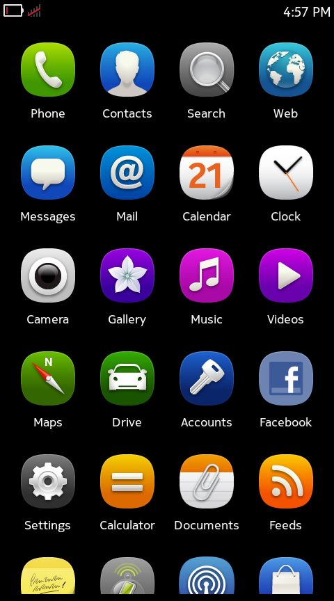
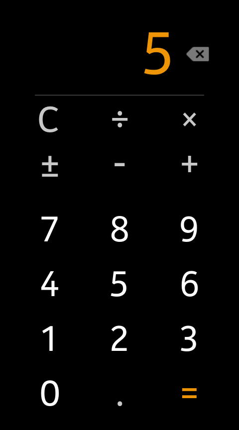
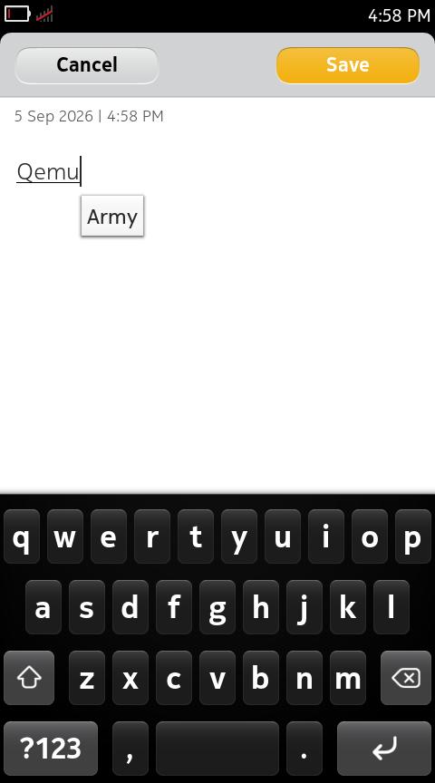
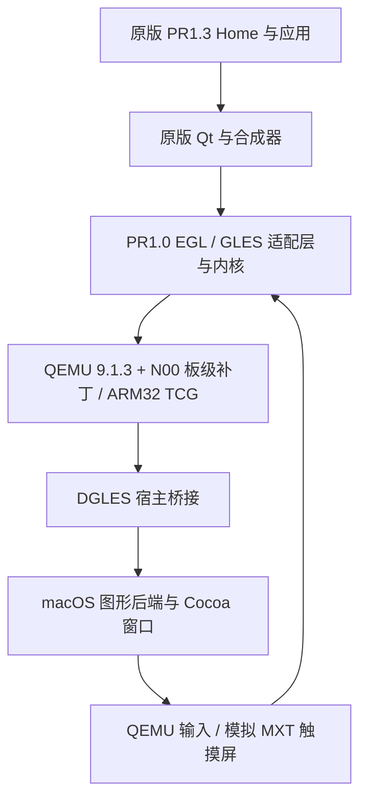

# Harmattan QEMU

[English](README.md) · [构建](docs/building.zh-CN.md) · [状态](docs/status.zh-CN.md) · [参与贡献](CONTRIBUTING.zh-CN.md)

**在 Apple Silicon 上运行、研究和保存 Nokia N9 的原版 Harmattan 体验。**

Harmattan QEMU 将 Nokia 的实验性 N00 板级支持移植到 QEMU 9.1.3，并将旧图形协议接到原生 macOS 后端。它运行原版 Harmattan ARM 软件，包括 Home 桌面、部分应用、合成器和屏幕键盘。

这是一个实验性的系统保存项目。宿主为原生 ARM64 macOS；客体仍通过 TCG 执行 ARM32 代码，组合 PR1.0 时期的模拟器内核、适配层和 PR1.3 量产用户态。它不是 Nokia 官方模拟器，也尚未完整模拟 N9 硬件。

## 运行画面

| 原版 Home | Calculator：2 + 3 = 5 | Notes 与 Maliit 键盘 |
| --- | --- | --- |
|  |  |  |

2026-09-05，在 Apple Silicon 上使用公开移植版本的干净构建采集。图片为无窗口客体运行中直接导出的 QMP 截图，保留原始字节；Notes 文字是诊断输入。[采集说明](docs/screenshots/README.zh-CN.md)记录环境、来源和原界面署名。静态画面不能展示动画流畅度或 macOS 窗口交互。

## 仓库内容

- OMAP3/N00 板级、内存、存储、显示、电源和触摸设备补丁。
- 受限的 EGL/GLES 桥接与 Nokia DGLES 宿主库移植。
- Cocoa 显示、旋转、输入活动声明和异步退出支持。
- 面向原版合成器、方向、键盘及显示交接的客体兼容辅助代码。
- 主机测试及有明确失败检查的客体诊断。

研究基线已验证原版 Home 滚动、Calculator 运算及边缘返回、Maliit 键盘在 Notes 中输入、状态栏时间更新和部分应用切换采样。请先阅读[状态与证据边界](docs/status.zh-CN.md)，这些结果不代表所有应用均兼容。

## 无需系统镜像即可开始

可以直接阅读补丁并运行主机测试。已测试的 Python 基线为 3.12；macOS 原生测试还需要 Xcode Command Line Tools。Linux 会跳过 AppKit 专属测试。

```sh
git clone https://github.com/YZune/harmattan-qemu.git
cd harmattan-qemu
python3 -B -m unittest discover -s scripts/harmattan-qemu/tests -p 'test_*.py'
python3 scripts/check-public-tree.py
```

## 使用 coding agent 参与

在仓库根目录打开工程，让 agent 读取 [AGENTS.md](AGENTS.md)；贡献者也可以阅读[中文版](AGENTS.zh-CN.md)。其中说明无需镜像的检查、干净构建、客体前提、补丁归属和贡献边界。如果工具不会自动发现该文件，请将它显式加入任务上下文，参见 [AGENTS.md 格式说明](https://agents.md/)。

初次可以这样描述任务：“阅读 AGENTS.md，检查当前 checkout，运行不需要固件的检查。单独列出构建或客体运行缺少的前提，再汇总实际结果。”

## 运行 Harmattan

预编译应用见 [macOS 预览版说明](docs/releases.zh-CN.md)和 [GitHub Releases](https://github.com/YZune/harmattan-qemu/releases)。包内提供运行时和代码绘制的设备外框，仍需自行提供已经准备的客体磁盘及对应内核。

**镜像和内核从哪里获取？** 请看[资源获取与准备指南](docs/guest-inputs.zh-CN.md)，其中提供两个准确下载链接、校验值和本地准备脚本。脚本不安装旧 SDK，而是提取其内容，并从指定 PR1.3 固件生成新的磁盘。

完整客体运行需要**用户自行提供历史输入文件**。本仓库不分发固件、内核二进制、系统镜像、字体或机身素材；克隆仓库不会直接得到可启动虚拟机。

请按[中文构建说明](docs/building.zh-CN.md)或 [English build guide](docs/building.md)操作。文档说明依赖、输入位置和摘要、构建顺序、独立快照及现有镜像重建缺口。默认窗口无需机身外壳。

## 工作方式



## 一起完善

适合首次参与的工作包括：在另一台 Mac 验证安装流程、完善输入准备、复现一个应用问题，以及改进中英文文档。也欢迎参与图形、设备模型和 Linux 宿主适配。[路线图](docs/roadmap.zh-CN.md)为各项工作列出了具体完成条件。

请阅读[贡献指南](CONTRIBUTING.zh-CN.md)。Issue 和 Pull Request 均可使用中文或英文。

## 文档

| 主题 | 简体中文 | English |
| --- | --- | --- |
| macOS 预编译预览版 | [Guide](docs/releases.md) | [指南](docs/releases.zh-CN.md) |
| 构建与运行 | [指南](docs/building.zh-CN.md) | [Guide](docs/building.md) |
| 架构与补丁 | [架构](docs/architecture.zh-CN.md) | [Architecture](docs/architecture.md) |
| 兼容性与验证 | [状态](docs/status.zh-CN.md) | [Status](docs/status.md) |
| 来源、输入和许可 | [来源](docs/sources.zh-CN.md) | [Sources](docs/sources.md) |
| 后续工作 | [路线图](docs/roadmap.zh-CN.md) | [Roadmap](docs/roadmap.md) |
| 参与贡献 | [指南](CONTRIBUTING.zh-CN.md) | [Guide](CONTRIBUTING.md) |
| 本地开发管理 | [流程](docs/development.zh-CN.md) | [Workflow](docs/development.md) |
| Coding agent 工作说明 | [中文版](AGENTS.zh-CN.md) | [AGENTS.md](AGENTS.md) |
| 运行截图 | [采集说明](docs/screenshots/README.zh-CN.md) | [Provenance](docs/screenshots/README.md) |

## 许可与致谢

无更具体声明的项目新增代码及文档使用 **GPL-2.0-or-later**。继承自 QEMU/Nokia 的文件保留原许可选择，其中部分范围更窄；明确标记 MIT 的代码仍采用 MIT。请阅读 [NOTICE](NOTICE) 与[来源及权限清单](docs/sources.zh-CN.md)。根目录 [LICENSE](LICENSE) 为 GPLv2 正文，不会改变外部客体软件或素材的许可。

项目建立在 QEMU、Nokia N00/DGLES、Harmattan 源码发布，以及保存这些材料的社区与档案机构的工作之上。Nokia、MeeGo、Harmattan、QEMU 名称用于标识原项目，不表示官方关联或背书。

特别感谢 OpenAI 的 **GPT 与 Codex** 在整个项目中的持续协作：从历史源码研究、模拟器移植、图形与交互调试，到验证工具、中英文文档和发布准备。仅凭我一个人的力量，无法把这个项目推进到今天。它们的帮助，让我对 Nokia N9 的好奇最终成为了一个重新运行起来的模拟器，也成为了一个可以与社区分享的项目。
